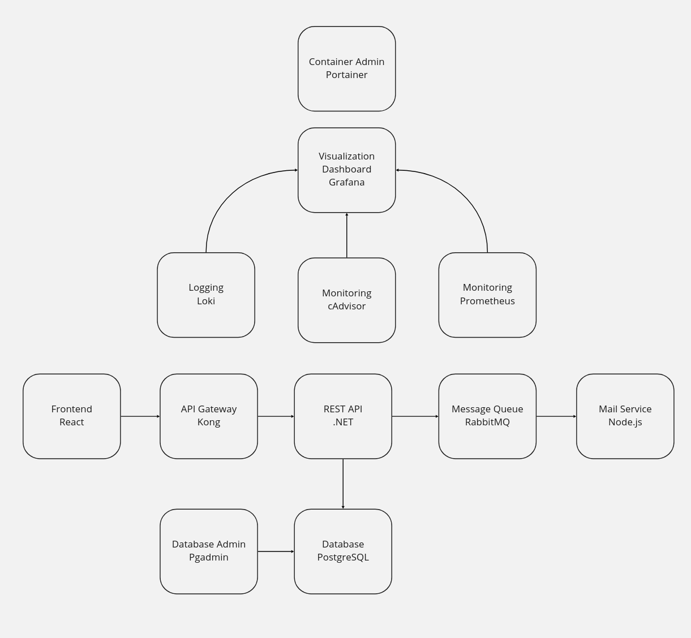

# Petaway

Petaway is a web platform aiming to help animals stuck in the Ukraine conflict.


# Project team

PWEB
* Calin-Andrei BUCUR 342C4
* Catalin-Mihail CHIRU 342C4
  
IDP
* Carapcea Andrei-Antonio 342C1
* Rusu Bianca-Ana-Maria 342C2


# Architecture



# Backend Architecture


# Tactical Domain Driven Design


# Running instructions

You can run a setup script with:

```
npm run setup
```

This will install all dependencies (eg. `node_modules`) for the subprojects.

You can start all dependency components (postgres, rabbitmq, pgadmin) with:
```
npm run deps
```

You can run a single component, for example the backend with:
```
npm run dev:api
```
Or the frontend with:
```
npm run dev:frontend
```

You can build a docker image for each component, for example:

```
npm run docker:mail:build
```
You can also build all the docker images with:
```
npm run docker:all:build
```
